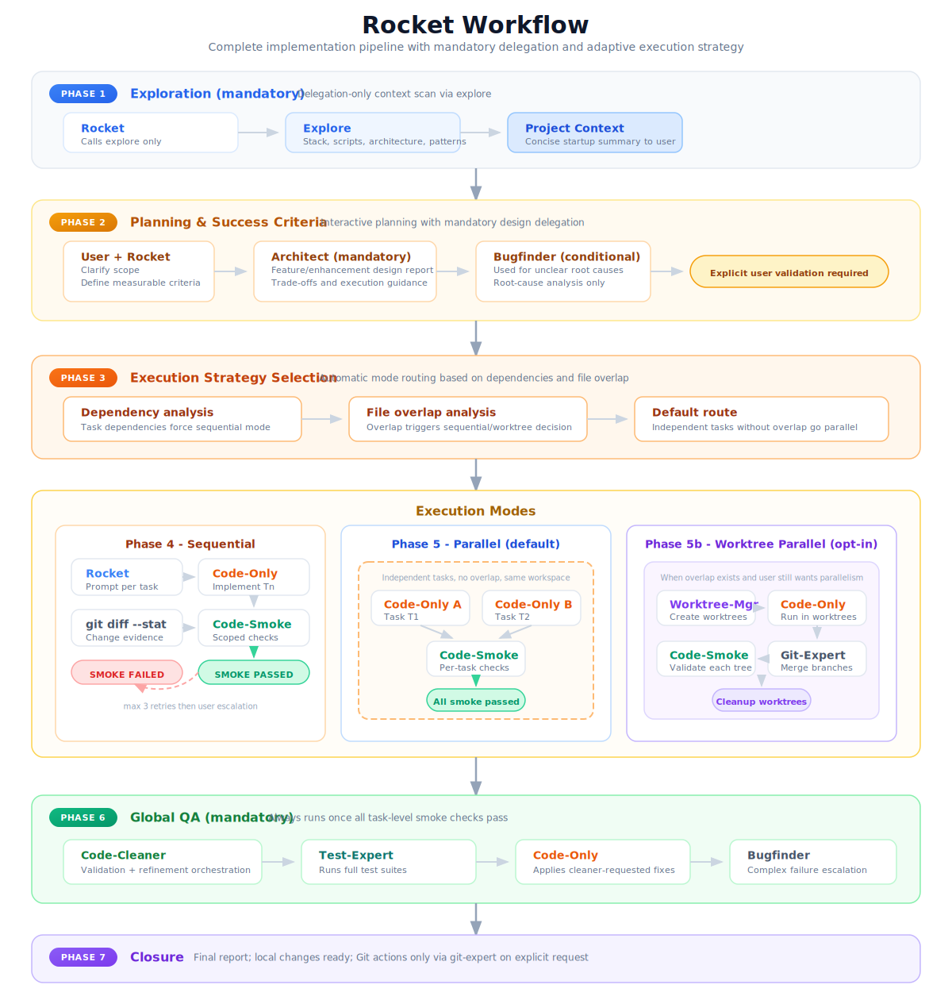
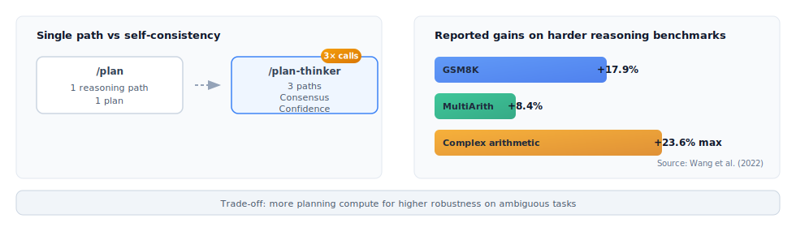
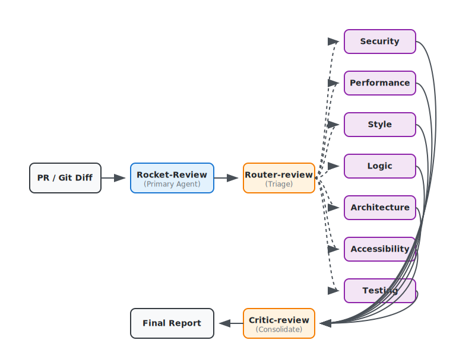

# OpenCode Workflows

Two AI-powered workflows for software engineering: **rocket** for implementation, **rocket-review** for code auditing. Both rely on strict delegation to specialized subagents rather than monolithic execution.

---

## Architecture Philosophy

Every design choice in these workflows serves one or more of these principles:

- **Structural enforcement over prompt-based rules** — If an agent shouldn't do something, remove the capability. Don't just ask nicely. rocket has no access to `edit`/`write` tools, making it physically impossible to code directly — far more reliable than a prompt instruction saying "please don't code."
- **Context hygiene** — LLM context windows are finite and precious. The orchestrator (rocket) never loads full diffs or file contents. It delegates, receives concise reports, and moves on. This prevents context pollution and keeps the orchestrator sharp across long multi-task sessions.
- **Constraints-first prompting** — Critical rules are placed at the top of every prompt, before the workflow description. LLMs exhibit primacy bias — instructions read first are followed more reliably, especially by smaller models.
- **English prompts, localized responses** — All system prompts and subagent instructions are written in English for maximum instruction-following accuracy across model sizes. The orchestrator responds to the user in French via an explicit language directive.
- **Single responsibility per agent** — Each subagent does exactly one thing. `code-only` codes. `code-smoke` validates. No agent wears multiple hats. This reduces hallucination and improves output quality.
- **Fail-fast with bounded retries** — Every implementation task has a max 3-attempt loop with smoke checks. If it can't be fixed in 3 tries, the system stops and asks for human help instead of spiraling.

---

## Agents & Subagents

### Primary Agents (User-Facing)

| Agent | Role |
|---|---|
| **rocket** | Tech Lead & orchestrator. Designs, plans, delegates, supervises. Never codes directly — **all file modifications go through `code-only`**. |
| **rocket-review** | Audit orchestrator. Analyzes diffs via parallel specialized audits and produces actionable reports. |

### Subagents (Internal Specialists)

| Agent | Role | Used by |
|---|---|---|
| **explore** | Fast codebase discovery and mapping (structure, files, patterns, conventions). Read-only. | rocket |
| **architect** | Mandatory design authority for features/enhancements/structural changes. Read-only analysis. | rocket |
| **bugfinder** | Relentless Deep Code Intelligence & Root Cause investigation. Used for any complex logic understanding or unexpected behavior. Read-only. | rocket |
| **code-only** | Implements code changes from structured specs. Responds "DONE" or "ERROR". | rocket |
| **code-smoke** | Unified validation agent: per-task (syntax+lint) and final (syntax+lint+tests+build). Reports diagnostics, never fixes. | rocket |
| **worktree-manager** | Creates/cleans isolated Git worktrees for opt-in parallel execution with file overlap. | rocket |
| **git-expert** | Git operations: merge, commit, push, rebase, history cleanup. Invoked only on explicit user request. | rocket (on-demand), worktree flow |
| **router-review** | Triage agent. Analyzes diffs and selects relevant audit focuses. | rocket-review |
| **code-audit** | Specialized auditor. One instance per focus (Security, Perf, Logic, etc.). | rocket-review |
| **critic-review** | Senior auditor. Consolidates audit reports, challenges findings, filters false positives. | rocket-review |

---

## rocket Workflow

### What Rocket is

**Rocket is a command-driven Tech Lead orchestrator.** The system is built on a clear separation between persona and workflow:

- **The prompt defines how Rocket behaves** — the agent persona, tone, and guardrails are encoded in the system prompt.
- **The commands define what workflow step happens next** — `/clarify`, `/plan`, `/execute` are explicit triggers that move the process forward.
- **This separation keeps the workflow flexible without changing the persona** — you can add new commands or modify the flow without touching the core identity.

### Base workflow (main path)

The default workflow follows a strict chain with mandatory gates:

1. **Request** — User describes the task in natural language.
2. **Exploration** — Rocket automatically calls `explore` to map the codebase. This step is mandatory before any clarification.
3. **`/clarify`** — Iterative phase where Rocket reformulates the request, identifies gaps, and challenges assumptions constructively.
4. **`/plan`** — User triggers planning. Rocket calls `architect` in classic mode to produce an implementation plan with atomic tasks.
5. **User validation** — User reviews and explicitly validates the plan before execution proceeds.
6. **`/execute`** — Rocket launches the full implementation workflow: delegates all coding to `code-only`, validates each task with `code-smoke`, and runs a final global validation.
7. **Closure** — Rocket provides a concise summary of completed work.

```
Request → Exploration → /clarify → /plan → [User validates] → /execute → Closure
```



### Why this workflow is easy to understand

| Aspect | Count | Details |
|--------|-------|---------|
| **Explicit user control points** | 3 | Ask in natural language → Type `/plan` → Type `/execute` |
| **Mandatory quality gates** | 2 | Architect plan before execution → Final validation after execution |
| **Bounded retry policy** | 1 | Max 3 retries on validation failure, then human escalation |

### `/plan-thinker` as an alternative

At planning time, users can choose `/plan-thinker` instead of `/plan` for ambiguous, high-risk, or architecture-heavy tasks. This alternative path:

- Spawns multiple parallel reasoning paths (currently documented as 3 parallel reasoning paths in this repository)
- Synthesizes results with confidence scoring based on consensus
- Provides better robustness on complex reasoning tasks

### Why use /plan-thinker for harder tasks?

Classic `/plan` follows one reasoning path. `/plan-thinker` runs 3 independent reasoning paths, synthesizes the result, and reports a confidence score. The trade-off is simple: 3× more planning calls for better robustness on ambiguous or high-risk tasks.



- **Reported gains**: +17.9% on GSM8K, +8.4% on MultiArith, and up to +23.6% on complex arithmetic reasoning versus single-path baselines [1][2]
- **Use `/plan-thinker` when**: architecture decisions, complex refactoring, or ambiguous requirements make missed alternatives expensive
- **Use classic `/plan` when**: the task is routine and a faster single-path plan is sufficient

*[1] Wang et al., "Self-Consistency Improves Chain of Thought Reasoning in Language Models", https://arxiv.org/abs/2203.11171*
*[2] Ibid., Table 2, MultiArith results*

### Commands table

| Command | Description |
|---------|-------------|
| `/clarify` | Clarify and challenge the request |
| `/plan` | Default planning path |
| `/plan-thinker` | Alternative planning path for complex cases |
| `/execute` | Run the validated plan |

---

## rocket-review Workflow

### What rocket-review is

`rocket-review` is a prompt-driven audit orchestrator, not a command chain. Its value comes from three design principles: **specialization** (each auditor focuses on one concern), **parallelism** (audits run concurrently), and **critic consolidation** (a senior auditor filters and merges findings). It reviews Git diffs or PR changes and produces either a user-facing audit report and/or a `rocket Implementation Brief`.

### Base workflow (main path)

The workflow follows exactly 4 stages:

1. **Triage** — `router-review` analyzes the diff and selects relevant audit focuses.
2. **Parallel specialized audits** — Multiple `code-audit` instances run concurrently, each focused on a single aspect.
3. **Critic consolidation** — `critic-review` consolidates all audit reports, challenges findings, resolves contradictions, and filters false positives.
4. **Final report / implementation brief** — A comprehensive review report or prioritized implementation brief is delivered.

```
Diff / PR → Router triage → Parallel audits → Critic filter → Final report / Rocket brief
```



### Why this workflow is easy to understand

| Aspect | Count | Details |
|--------|-------|---------|
| **Explicit stages** | 4 | Triage → Parallel audits → Critic consolidation → Final report |
| **Parallel layer** | 1 | All `code-audit` instances run concurrently |
| **Filtering authority** | 1 | `critic-review` is the sole consolidator and filter |
| **Handoff target** | 1 | `rocket` consumes the implementation brief |

### Roles in the pipeline

| Role | Responsibilities |
|------|------------------|
| `rocket-review` | Orchestrates the review flow and presents results to the user |
| `router-review` | Analyzes the diff and selects relevant audit focuses for triage |
| `code-audit` | Performs one focused audit per selected concern (Security, Performance, etc.) |
| `critic-review` | Consolidates audit reports, deduplicates findings, and rejects false positives |

### Current audit focus model

The implemented focus taxonomy includes:

| Focus | What it checks |
|-------|----------------|
| Security | Vulnerabilities, insecure data handling, potential exploits |
| Error & Resilience | Async handling, error boundaries, race conditions, edge cases |
| Logic & Business Rules | Core algorithms, business logic, invariants, state consistency |
| Performance & Scalability | Re-renders, loops, DB/IO efficiency, caching, bundle size |
| Architecture & Maintainability | Coupling, SOLID, DRY, modularity, testability |
| Readability & Idiomatic | Style, code patterns, comments, naming conventions |
| Regression Check | Post-fix verification to ensure no new bugs or side effects were introduced |

**Important notes:**

- `Regression Check` is **optional** and used only for post-fix verification, not during initial triage.
- `router-review` currently routes only the initial six review focuses and **excludes** `Regression Check` during initial triage.

### Why this workflow works

- **Selective routing lowers cost and noise** — Only relevant audits are triggered based on the diff.
- **Parallel specialists increase depth** — Each auditor has a narrow focus, producing higher-confidence findings.
- **Critic reduces false positives** — `critic-review` filters hallucinations and merges overlapping issues.
- **Final output is implementation-ready** — The consolidated report feeds directly into `rocket` for execution.

**Caution:** This workflow is a filtering pipeline, not a guarantee of perfect bug detection. The `critic-review` stage serves as the safeguard against preventive-documentation false positives (e.g., mistaking a "CRITICAL" comment documenting an avoided pitfall as an active bug). Do not expect hallucination-free review or perfect accuracy.

---

## rocket-review to rocket Handoff

The two workflows can be chained. When `rocket-review` completes its audit, it produces a **rocket Implementation Brief** — a structured document containing:

- Prioritized list of issues found
- Suggested fixes with technical context
- Severity classification

This brief can be passed directly to `rocket` as input for a new implementation session. `rocket` consumes the brief as structured input for planning and execution. This creates a closed loop: **Review → Brief → Implementation → Re-review**.


